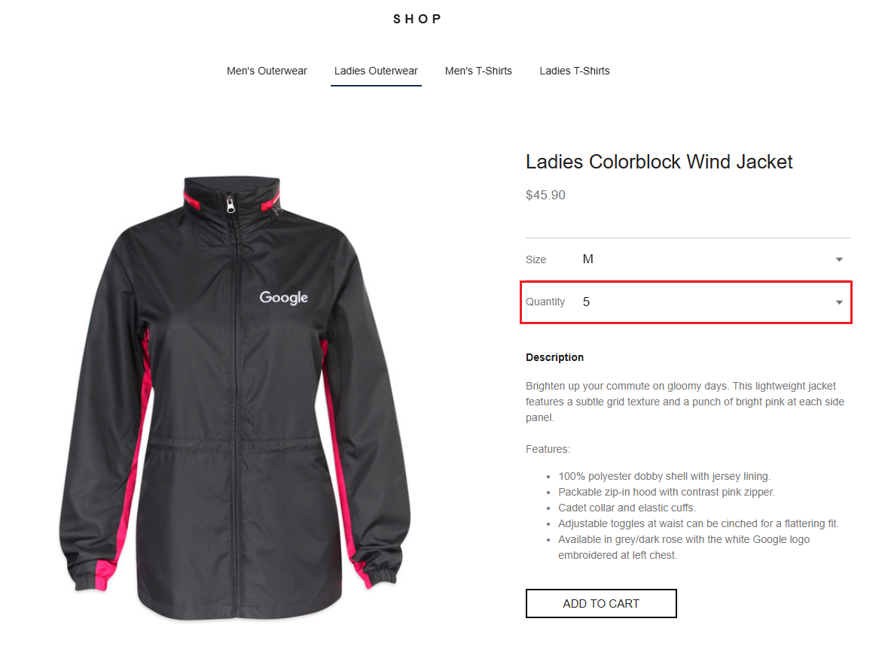
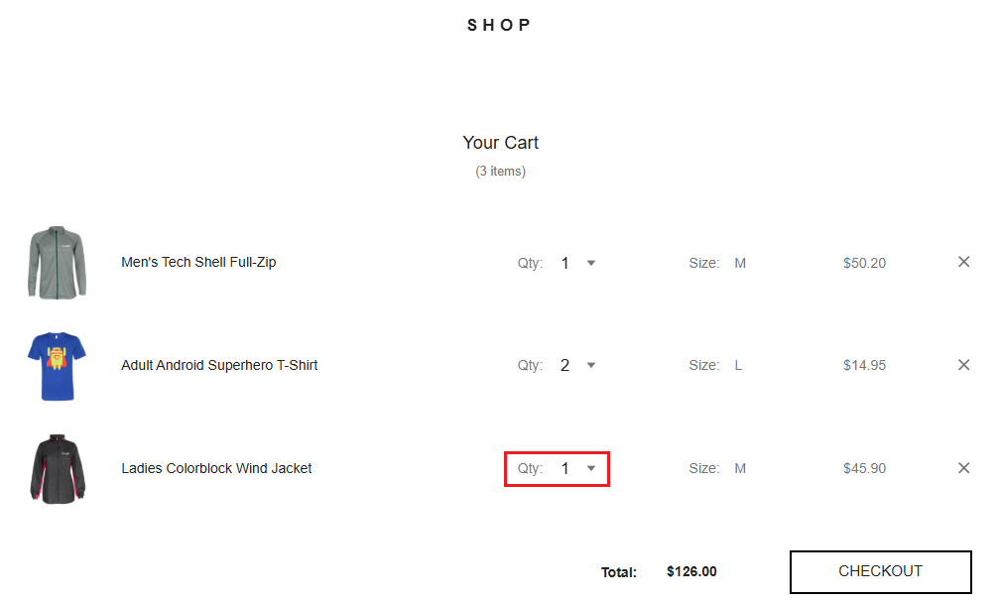

# Bug Report - Incorrect Quantity Added to Cart

## Page/Location

Cart

## Description of Issue

When the user attempts to add an item to the cart with a quantity > 1, only 1 of the item is added to the cart successfully.

## Expected Behavior

The correct quantity of an item should be added to the cart when the user clicks Add to Cart

## Actual Behavior

When the quantity > 1 and the user clicks Add to Cart, only 1 of the item is added to the cart

## Screenshots/Video

## Risk Assessment

This issue is high risk with high visibility, as it can impact anyone attempting to purchase more than one of a given product.

## Priority

High

## Steps to Reproduce

### Preconditions

* the user has navigated to the Product Details Page (PDP) for the item in question on the e-commerce website
* the quantity > 1

### Steps

1. click the 'Add to Cart' button
2. navigate to the cart
3. observe that only 1 of the item in question was added to the cart